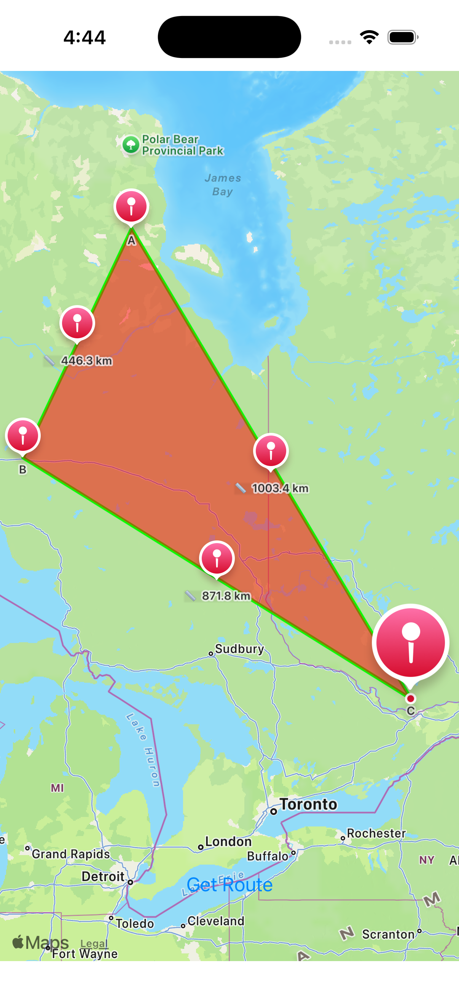
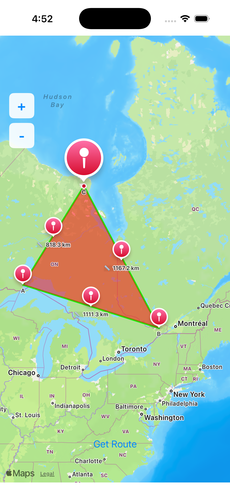
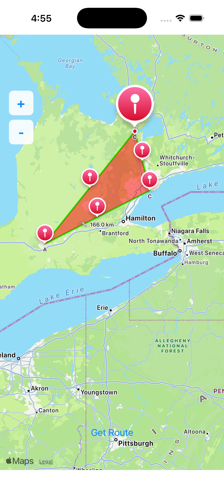
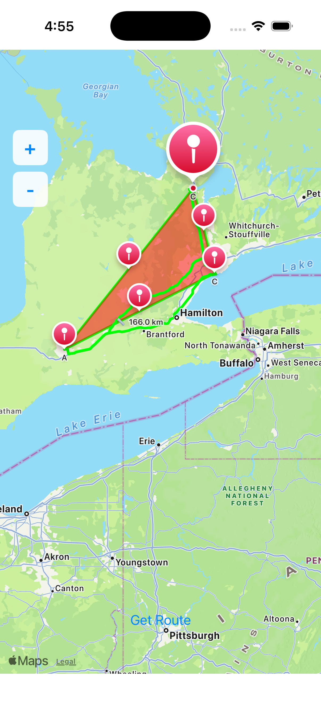

# Lab 9 - Ontario Map Application
**Course:** Mobile Application Development II — CRN-58080-202502  
**Student:** Nezihe Tekin  
**Due:** April 9, 2026

---

## Overview

An iOS application built with **UIKit (Storyboard)** and **MapKit** that allows users to tap three locations in the province of Ontario on a map. After the third tap, the app connects the points with green lines, fills the triangle with 50% transparent red, displays distances between each pair of points, and provides turn-by-turn route guidance from point A → B → C → A.

---

## Features

| Feature | Description |
|---|---|
| 📍 Tap to Add Pin | Tap anywhere on the map to place pins labeled A, B, and C |
| ❌ Tap to Remove Pin | Tap near an existing pin to remove it |
| 📐 Triangle Drawing | After 3 pins, connects them with green straight lines |
| 🔴 Area Fill | Fills the triangle with red color at 50% transparency |
| 📏 Distance Labels | Displays straight-line distance in km beside each edge |
| 🚗 Route Guidance | "Get Route" button draws driving route A → B → C → A |
| 🔍 Zoom Controls | On-screen + / − buttons for easy zoom in/out |

---

## Tech Stack

- **Language:** Swift
- **UI Framework:** UIKit + Storyboard
- **Mapping:** MapKit (MKMapView, MKPolyline, MKPolygon, MKDirections)
- **Location:** CoreLocation (CLLocation, CLLocationCoordinate2D)
- **Minimum iOS:** 26.2
- **Device:** iPhone 17 Pro (Simulator)

---

## How to Run

1. Clone the repository
2. Open `Lab9_OntarioMap.xcodeproj` in Xcode
3. Select an iPhone simulator
4. Press `Cmd + R` to build and run

---

## Usage

1. **Add pins:** Tap three different locations in Ontario — pins will be labeled A, B, C
2. **Triangle appears:** Green edges and red fill are drawn automatically after the 3rd tap
3. **Remove a pin:** Tap near any existing pin to remove it
4. **Get Route:** Tap the **Get Route** button to display the driving route A → B → C → A
5. **Zoom:** Use the **+** and **−** buttons on the left side of the screen

---

## Screenshots

| Triangle + Distances | Zoom Controls | Before Route | After Route |
|---|---|---|---|
|  |  |  |  |
